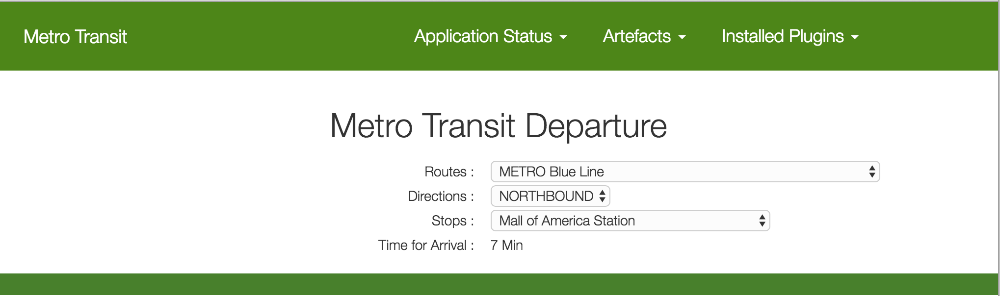

# MetroTransit 

This project uses Metro Transit's REST API (http://svc.metrotransit.org/) to tell you how long it is until the next bus on given route, direction & stop.

This project is developed using grails & angularjs framework, and pushed to cloud-foundry @ http://metrotransit.cfapps.io, after every successful build from [Travis CI](https://travis-ci.org/saravanakumar-periyasamy/metroTransit).

## Requirements

* Oracle Jdk 8
* Grails 3.1.4
* sdkman
 
## Install

1. Install sdkman `curl -s get.sdkman.io | bash`
2. Install grails `sdk install grails`
3. Run the app `./gradlew bootRun` and you should be access the app @ http://localhost:8080
4. Run the test `./gradlew check`
